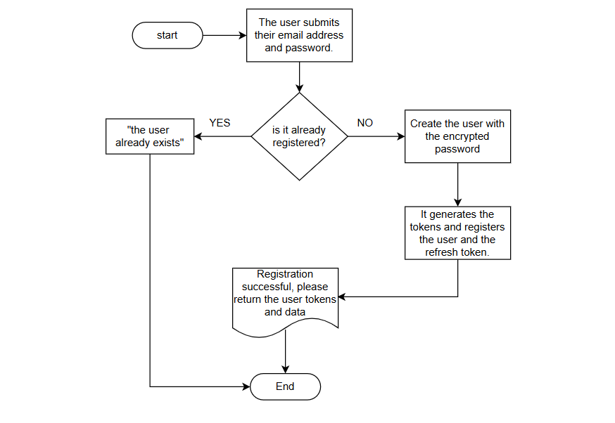
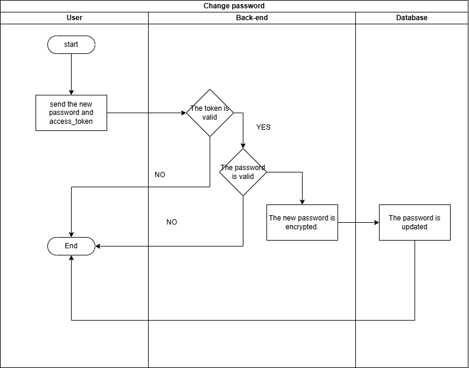

<center>
  <h1>Diseño y creación de un sistema de autenticación utilizando API REST y JSON Web Tokens</h1>
</center>

> El presente repositorio consiste en repasar la teoría de un sistema de autenticación sencillo basado en tokens. Entre las funcionalidades estudiadas se incluyen el registro de usuarios, inicio de sesión, cambio de contraseña y el método de recuperación de usuario mediante un código OTP. También se incorpora el uso de `refresh tokens` para la renovación de tokens de acceso.

---

## Índice

1. [Descripción](#descripción)
2. [Aspectos importantes de seguridad](#aspectos-importantes-de-seguridad)
3. [Diseño del método de autenticación](#diseño-del-método-de-autenticación)
4. [Diagrama de las funcionalidades](#diagrama-de-las-funcionalidades)

---

## Descripción

Este ejercicio está implementado con **Express.js**; sin embargo, en teoría puede aplicarse a otros marcos de trabajo y lenguajes del lado del servidor.

## Aspectos importantes de seguridad

En entornos de producción, se recomienda no almacenar los tokens directamente en el navegador. Para este proceso, es preferible utilizar **cookies** con el atributo `HttpOnly` para evitar que puedan ser leídas o vulneradas mediante ataques **XSS**.

En cuanto a los tokens, se recomienda establecer un tiempo de expiración:
- `access_token`: **10–30 minutos**
- `refresh_token`: **7–15 días**

Las configuraciones mínimas recomendadas para las **cookies** son:

- **httpOnly**: `true`  
  Evita el acceso mediante `document.cookie` y bloquea ataques XSS.
- **secure**: `true`  
  Permite el envío de cookies únicamente bajo HTTPS.
- **sameSite**: `'strict'` / `'lax'`  
  Controla el envío de cookies desde otros sitios.  
  `'Strict'` es más seguro; `'Lax'` es un estándar balanceado.
- **maxAge**:  
  Define el tiempo de expiración de la cookie.

Al consumir la API, el cliente debe incluir:

```js
credentials: 'include'
````

De lo contrario, el servidor rechazará la solicitud.

### Configuración de CORS

Para evitar el uso indebido del servicio desde otros dominios:

* **origin**: Define los dominios permitidos.
  Usar `*` impide el uso de cookies.
* **credentials**: Debe ser `true` para permitir cookies.
* **methods**: Define los métodos HTTP habilitados (GET, POST, PUT, DELETE, etc.).

El uso de un **ORM** como Sequelize ayuda a mitigar ataques de **inyección SQL**.

## Diseño del método de autenticación

Componentes principales:

* **Base de datos:**
  Almacena correo electrónico, contraseña **hasheada**, rol del usuario y otros datos.
  En esta implementación, el `refresh_token` es un token **opaco** almacenado en base de datos.
  También se guarda el código **OTP** para la recuperación de cuentas.

* **Framework backend:**
  Entornos como **Node.js** o **.NET** permiten gestionar HTTPS, generación de tokens y control de acceso.

## Diagrama de las funcionalidades

### 1. Registro de un nuevo usuario

1. **Persistencia de datos:**
   Se almacenan los datos del usuario en la base de datos.
2. **Seguridad (hashing):**
   La contraseña se guarda utilizando algoritmos de hashing como bcrypt.
3. **Inicio de sesión automático (opcional):**

   * El controlador invoca al servicio de autenticación.
   * Se generan tokens `access` y `refresh`.
   * Mejora la experiencia de usuario (UX).

<p align="center">
  
</p>

### 2. Autenticación de un usuario

El usuario envía su **correo electrónico y contraseña**.
Si las credenciales son válidas, el sistema genera un **access token** y un **refresh token**, el cual se almacena en la base de datos junto con su fecha de expiración.

<p align="center">
  
</p>

### 3. Cambio de contraseña autenticado

El proceso utiliza el **access token** para identificar al usuario:

1. **Acceso restringido:** Solo usuarios autenticados pueden cambiar su contraseña.
2. **Integridad:** La identidad del usuario se obtiene directamente del token firmado.

<p align="center">
  
</p>

### 4. Recuperación de cuenta

El usuario solicita un código **OTP** de seis dígitos que es enviado a su correo electrónico.
Este código permite validar su identidad sin necesidad de acceso previo al sistema.

Si el código expira, el usuario debe solicitar uno nuevo.

#### Flujo de recuperación

```pseudocode
INICIO
  solicitar correo
  generar OTP
  enviar OTP
  esperar OTP y nueva contraseña

  SI OTP es válido Y no ha expirado ENTONCES
      actualizar contraseña
      marcar OTP como usado
  SINO
      mostrar error
  FIN SI
FIN
```

## Método para refrescar sesiones

Cuando el **access token** expira y el servidor responde con `401` o `403`, el cliente utiliza el **refresh token** para obtener nuevos tokens.

```pseudocode
FLUJO RenovaciónDeSesión

INICIO
  cliente solicita recurso con access token

  SI access token es válido
      permitir acceso
  SINO
      solicitar refresh token

      SI refresh token es válido
          generar nuevos tokens
          reintentar solicitud
      SINO
          redirigir a login
      FIN SI
  FIN SI
FIN
```

## Actualización autónoma del access token

Existen dos enfoques:

* **Validación basada en tiempo:**
  El cliente detecta cuándo el token está próximo a expirar y solicita uno nuevo de forma preventiva.

* **Renovación por solicitud:**
  Ante una respuesta `401` o `403`, se ejecuta automáticamente la renovación mediante un interceptor o función asíncrona.

## Detección de sesión expirada

La sesión se considera expirada cuando:

* El token ha caducado, o
* La renovación falla tras recibir una respuesta no autorizada.

En ambos casos, el sistema redirige al usuario al inicio de sesión.

## Referencias

- Ayebola, J. (2025, 25 noviembre). How to Build a Secure Authentication System with JWT and Refresh Tokens. freeCodeCamp.org. https://www.freecodecamp.org/news/how-to-build-a-secure-authentication-system-with-jwt-and-refresh-tokens/

- JWT. (2024, 30 noviembre). JSON Web Token Introduction JWt.io. JSON Web Tokens - jwt.io. Recuperado 14 de enero de 2026, de https://www.jwt.io/introduction
- S, T. (2018, 26 febrero). Where to store access-token in react.js? Stack Overflow. https://stackoverflow.com/questions/48983708/where-to-store-access-token-in-react-js